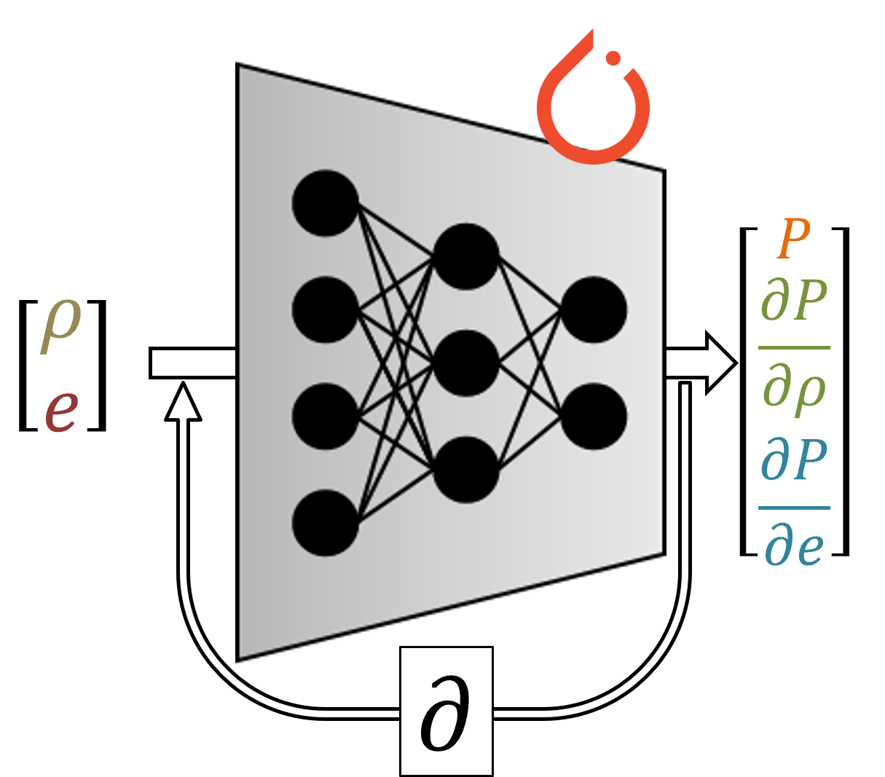

# ML EOS

{width=40% height=40%}{: .shadow}

The ML EOS package provides a complete Python framework for training a deep neural network from scratch to reproduce a legacy (JWL) equation of state (EOS). The JWL EOS has been widely used to represent the thermodynamic equation relating the state variables of an ideal explosive product gases behind a detonation front. The JWL expression for pressure and sound velocity are:

```math
P(\rho, e) = A \left[ 1 - \frac{\omega \rho}{\rho_0 R_1} \right] e^{-\frac{R_1 \rho_0}{\rho}} +B \left[ 1 - \frac{\omega \rho}{\rho_0 R_2} \right] e^{-\frac{R_2 \rho_0}{\rho}} + \omega e \rho   \qquad ; \qquad   c^2(\rho, e) = \left( \frac{\partial P}{\partial \rho} \right)_e + \frac{P}{\rho^2} \left( \frac{\partial P}{\partial e} \right)_{\rho}
```

## Installation

You can install and utilize this repo by executing the following commands

```bash
git clone git@gitlabserver:francis.g.vangessel.civ/ml_eos.git
cd ml_eos
conda env create -f torch_env_reqs.yml
conda activate torch_env
python train_model
```

## Usage

Changes to the default parameters of this project (e.g. JWL EOS parameters, training hyperparameetrs, and number of training data points) are controlled through the config.yaml file.

{width=100% height=100%}{: .shadow}